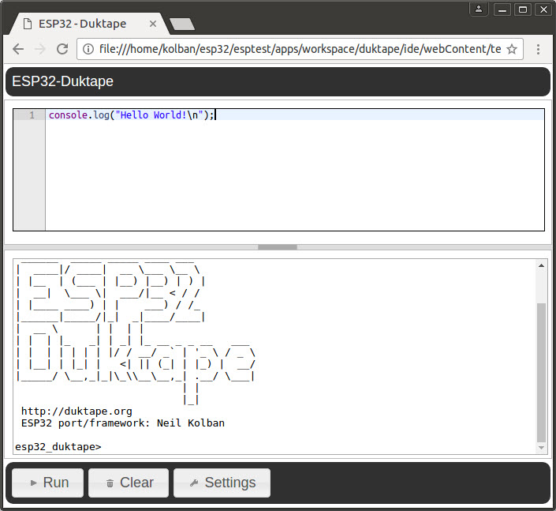

# Browser based JavaScript editor
When ESP32-Duktape starts we can point a browser at it and we will be presented with
a JavaScript editor in which we can enter and run JavaScript programs.  Here is what the browser
environment looks like:

At the top of the window we have a full function JavaScript editor with syntax hilighting and error
checking.  Beneath that we have the console output from our JavaScript environment.

The button bar at the bottom provides the following:

* Run - Run the script currently shown in the editor by sending it to the ESP32 for execution.
* Clear - Clear the console log output.
* Settings - Open a settings dialog to supply configuration settings.

## WebSocket console response
As scripts run within the environment, we want the console messages to be sent back to the user so that
they can see the results.  This is best achieved with WebSockets.  When the browser based IDE loads, it
can form a WebSocket connection back to the ESP32.  This will be understood by the ESP32 as the 
destination for console output.  Since we are implementing the framework in JavaScript itself, this needs
to take account of that notion.  We have a set of modules that should make this work for us.

First there is the "ws" module (WebSocket).  This module allows the ESP32 to be a WebSocket server and hence
receive incoming websocket client connection requests.

Next there is the concept of the `handler` on the `console` object.  This is a property that should be a
function reference.  When a console message is logged, the handler will be invoked with the message.

If we then tie these together, when a websocket connection request is received, we can register the handler
to send the message down that socket.

By default, the Web Socket connection to show console output from `log.console()` is disabled but can
be quickly enabled by clicking the enable button.  The reason that it is disabled by default is that
running a Web Socket server inside the ESP32 as well as maintaining at least one active Web Socket
connection isn't free.  The RAM cost appears to be on the order of 10K.  It was decided to switch
the Web Console off by default until such time as optimization of the ESP32-Duktape RAM usage has
improved and we are in less danger of running out. 