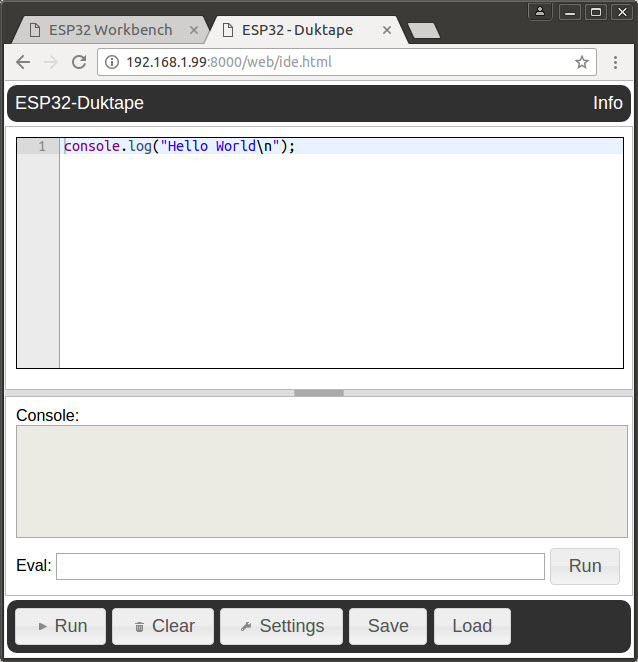

#ESP32-Duktape installation
This guide assumes that you have obtained (or built) the binary files ready to flash
into your ESP32.  The end goal will be to have ESP32 running JavaScript and
with a built in development environment.

We will use the `esptool.py` to load the binaries into the ESP32 flash memory.

The distribution consists of the following files:

* `esp32-duktape.bin` - The primary application binary.
* `partitions_singleapp.bin` - The partitions description for the application.
* `bootloader.bin` - The bootloader for the application.
* `spiffs.img` - An image of JavaScript files in SPIFFS format.
* `espfs.img` - An image of JavaScript files in ESPFS format.

The load addresses are:

|File                     |Address  |
|-------------------------|---------|
|bootloader.bin           |0x1000   |
|partitions_singleapp.bin |0x8000   |
|esp32-duktape.bin        |0x10000  |
|spiffs.img               |0x180000 |
|espfs.img                |0x360000 |

For example, on Linux with the ESP32 in flash mode, we can run the following:
```
$ python $IDF_PATH/components/esptool_py/esptool/esptool.py \
 --chip esp32 --port "/dev/ttyUSB0" --baud 115200 write_flash --flash_mode "dio" \
 --flash_freq "40m" --flash_size "4MB" --compress \
 0x1000   bootloader.bin \
 0x8000   partitions_singleapp.bin \
 0x10000  esp32-duktape.bin \
 0x180000 spiffs.img \
 0x360000 espfs.img
```

When all is complete, the ESP32 can be rebooted and we are ready to go.

#First boot
In order to use the ESP32-Duktape program, we need to be WiFi connected (at least
initially).  However, in order for an application to connect to *your* WiFi access point
we need to know its name (SSID) and the password you use to connect to it.  That means
that you have to supply it.  Ahh ... but wait, how do you supply that information when
you don't have network access?

When ESP32-Duktape boots, it looks in its flash memory for the network name
and password it should use.  Since on first boot, that is not present, the ESP32 itself
becomes a WiFi access point.  Here you can connect your phone (or other mobile device)
to it and open up a browser point to the IP address of your ESP32.

From there, you will be presented with the opportunity to enter a network name and
password.  Now, when you reboot your ESP32, it will connect to that network.  If the 
network connection fails (because you are now somewhere else or you change your password),
then the ESP32 will again reset to being an access point.

It is strongly recommend that you keep the console log up while the ESP32 is running
so that you can see the messages being written.

#Opening up the IDE
Once the ESP32 is up and running and executing the JavaScript environment, you can start
to run and write your scripts.  From your desktop PC, open a browser and point it to your
ESP32 at the IDE URL.  For example:

`http://192.168.1.99:8000/web/ide.html`

This will load the IDE that looks like:



#Using the IDE
In the top portion of the browser there is a JavaScript aware editor into which you can
enter your JavaScript code.  Pressing the `Run` button, causes that script to execute on
ESP32.  Any console output as written by `console.log()` statements will appear in the
`Console` area.  If you merely wish to execute a single statement, you can enter that
within the `Eval` area and click the `Run` button the right of the text input.

Clicking the `Load` button will open up a list of the files found in the flash storage
of the ESP32.  These are the files that are either pre-supplied or you have previously
saved.  From the resulting load dialog, you can select a file to open in the editor or
execute it directly on the ESP32 without changing your current editor content.

Should you wish to save your JavaScript, you can click the `Save` button and enter
(or select) the name you wish to save it as.  The file will be saved in the flash
storage of the ESP32.

At this time, I strongly advise you not to save the ONLY copy of your JavaScript to flash
but instead think about having a text editor open into which you copy and paste your
JavaScript.  At this stage in the project, we will be reflashing the ESP32 on a regular
basis and reflashing resets the content of the files in the flash memory and any files
you manually created or changed will be lost.


##Speeding up ESP32-Duktape
You may find that the ESP32-Duktape program feels a little sluggish.  The reason for this
is that at this early stage, a *lot* of debugging is still enabled and this is logged to
the ESP32 console ... which means that we are logging a lot of text at 115200 baud through
a serial port.  That slows us down.  We can reduce the debug logging by running the following
JavaScript:

```
ESP32.setLogLevel("*", "error");
```

You will find that performance jumps dramatically but now you won't get any log output.  To see
the log output again, run:

```
ESP32.setLogLevel("*", "debug");
```